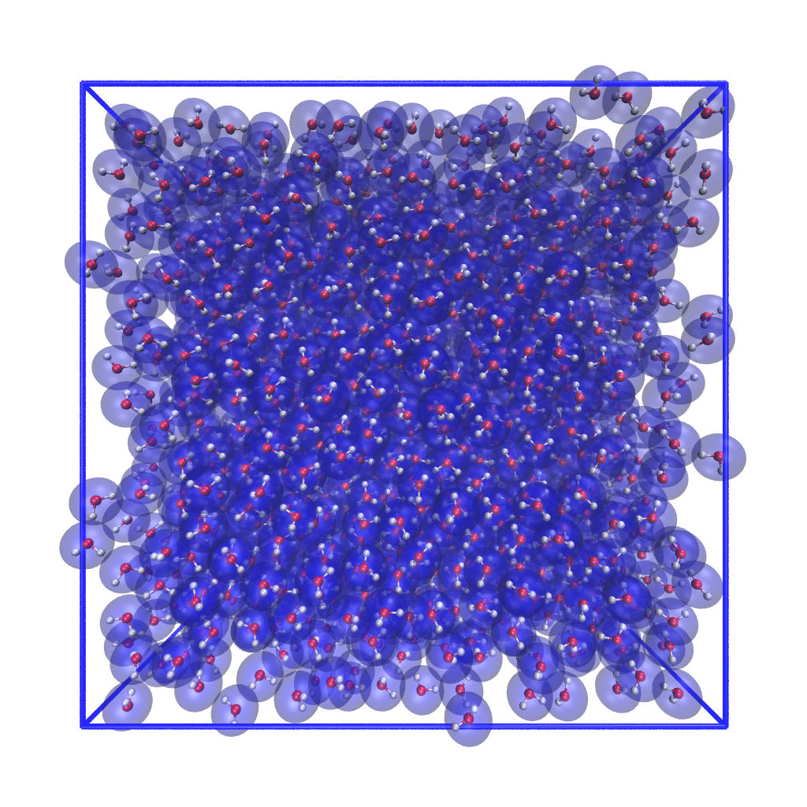
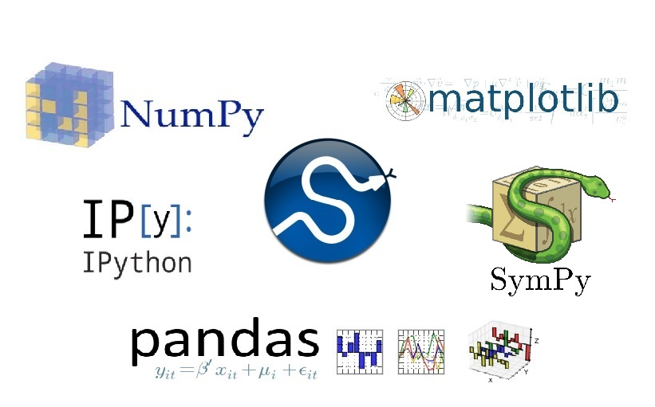

## Tonalli Rodríguez-Lopez

| Web Development Part Time Bootcamp
| Ironhack Mexico
| [\@t3rodrig][] &middot; [github.com/t3rodrig][] &middot; [linkedin.com/in/t3rodrig/][]

{.cg_box}
{.cg_box}
{.cg_box}
{.cg_box}

[\@t3rodrig]: https://twitter.com/t3rodrig
[github.com/t3rodrig]: https://github.com/t3rodrig
[linkedin.com/in/t3rodrig/]: https://www.linkedin.com/in/t3rodrig/

## Project

{#ecommerce}

## Demo

[iron-moonlight.netlify.app/](https://iron-moonlight.netlify.app/){#demo_link}
{#App-logo}
  
## Tonalli Rodríguez-Lopez

{.thanks}

